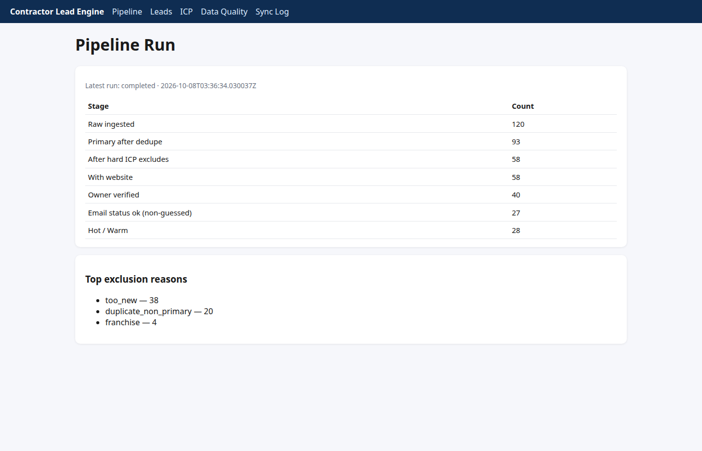

# Contractor Lead Engine (California)

> **Contractor Lead Engine — verified, ICP-scored local-business leads with a real reason to reach out**
>
> Builds lead lists from official public sources (e.g., California CSLB license data) plus company websites — not exported from Apollo. Every field carries its source URL and date. Dedupes by domain/phone/address, suppresses your never-contact and CRM lists, finds the owner (cross-checked, never guessed), and verifies emails (only "ok" ships; catch-all/role/guessed are flagged). An LLM scores each company against your ICP with evidence-linked reasons and hiring/years-in-business signals, then drafts a first line grounded in one verifiable fact for human approval. Pushes to HubSpot, Google Sheets or Instantly CSV, and exports a 50-row sample with a quality report so you can check before scaling. Python · FastAPI · Playwright · SQLite/Postgres · OpenAI-compatible LLM (offline fallback) · Docker.

Portfolio demo for Upwork lead-generation / outbound-engineering roles (CSLB trades niche).

## Problem → features (client pain points)

| Pain (from real job posts) | How this demo addresses it |
|---|---|
| Bounced / catch-all / stale emails | Per-contact verification status (`ok`, `catch_all`, `role_based`, `guessed`, …); default export is **ok-only**; syntax + MX + pluggable verifier (mock offline) |
| Bad-fit leads (franchise, solo, wrong geo) | YAML ICP hard filters + transparent exclusion reasons on the pipeline funnel |
| Duplicate outreach | Merge clusters on **domain / phone / normalized address**; non-primary rows flagged |
| No decision-maker email | Owner from **CSLB personnel × website team page**; blank + `not_found` when no match — no fabrication |
| “Why contact them now?” | Facts + signals (license tenure, careers/hiring, tech stack) with **evidence URL + snippet** |
| Need a sample before scaling | **50-row CSV + JSON quality report** from the Data Quality page |
| Tooling cost / ownership | Self-hosted FastAPI app, Docker, optional CRM adapters off by default |

## Architecture

```
docker compose
 ├─ mocksites/          Synthetic contractor websites (edge cases, offline)
 └─ app/ (FastAPI :8000)
      ingest → normalize → dedupe → crawl/enrich → contacts → verify
           → score (YAML ICP + LLM w/ grounding validator) → personalize
           → export / HubSpot dry-run
      SQLite (Postgres via DATABASE_URL)
```

## Run in ~2 minutes

### Docker (recommended)

```bash
docker compose up -d --build
make demo
open http://localhost:8000
```

### Local (venv, no Docker)

```bash
python3 -m venv .venv && .venv/bin/pip install -r requirements.txt
python3 -m http.server 8081 --directory mocksites &   # terminal 1
MOCK_SITES_BASE_URL=http://127.0.0.1:8081 .venv/bin/python -m app.cli demo
.venv/bin/uvicorn app.main:app --reload                 # terminal 2
```

### Tests

```bash
make test
# or: python3 -m pytest -q
```

## Demo data (CSLB)

This repository ships **`data/cslb_sample.csv`** (License Master + Personnel rows) cut from the official CSLB portal:

- **Source:** [CSLB Public Data Portal — List by County](https://www.cslb.ca.gov/OnlineServices/DataPortal/ListByCounty.aspx)
- **Download date:** 2026-10-08 (see `data/cslb_sample.meta.json`)
- **Scope:** Alameda + Sacramento counties; classifications **C-10, C-20, C-36**
- **Synthetic flag:** `false` (real public records; company websites are **synthetic** under `mocksites/` for demo safety)
- **Personnel names:** masked in the committed sample (`PersonnelName` → first name + last initial) for public portfolio use; refresh with full names locally via `make fetch-cslb` (omit `--mask-personnel`)

## Privacy (public demo)

CSLB **personnel / owner** names are public records but are **masked** in this repo and on the Vercel read-only demo so individuals do not appear on a portfolio site. Company names and license numbers are unchanged.

| Context | Behavior |
|---|---|
| `PUBLIC_DEMO=1` (default on Vercel via `api/index.py`) | Mask names in ingest, UI, and CSV exports |
| Local full-data run | Leave `PUBLIC_DEMO` unset; fetch fresh CSLB data without `--mask-personnel` |
| Committed `data/cslb_sample.csv` | Pre-masked personnel rows + `data/cslb_personnel_name_hashes.txt` for tests |
| `demo_snapshot/lead_engine.db` | Built with `PUBLIC_DEMO=1` (`make demo-snapshot`) |

Mask format: first name + last initial (e.g. `Maria G.`), deterministic per license when parsing fails.

Refresh the sample:

```bash
make fetch-cslb   # requires Playwright; downloads XLSX + statewide personnel CSV, writes cslb_sample.csv
python3 scripts/generate_mocksites.py
```

## Latest demo metrics (from last `make demo` run)

Values below come from `data/exports/quality_report.json` produced by the pipeline (not fabricated):

| Metric | Value |
|---|---:|
| Companies ingested | 120 |
| Merge clusters | 3 |
| Exportable leads (ok email, Hot/Warm, primary) | 20 |
| Owner verified | 63 |
| Tier mix | Hot 13 · Warm 15 · Cold 30 |
| Email verification mix | ok 47 · catch_all 14 · role_based 8 · guessed 9 · unknown 16 · invalid 1 |

Pipeline funnel (primary rows): **120 → 93 after dedupe → 58 after hard ICP → 27 with verified ok email → 28 Hot/Warm**.

## Dashboard pages

| Page | URL |
|---|---|
| Pipeline funnel | `/` |
| Leads table | `/leads` |
| Lead detail (facts, score reasons, draft) | `/leads/{id}` |
| ICP config | `/icp` |
| Data quality + sample export | `/quality` |
| CRM sync log (HubSpot dry-run) | `/sync` |

Screenshots (after demo): [`docs/screenshots/`](docs/screenshots/)



## Change the ICP

Edit [`presets/ca_contractors.yaml`](presets/ca_contractors.yaml) (counties, min years, weights, Hot/Warm thresholds), then rerun:

```bash
make demo
```

Or use **Recompute scores** on `/icp` (in-memory DB only; full rerun preferred for exports).

## Deploy (Vercel, read-only)

1. Ensure `demo_snapshot/lead_engine.db` is committed (regenerate with `make demo-snapshot` after mock sites are up on `:8081`).
2. Connect the repo to Vercel (Python runtime).
3. Uses [`vercel.json`](vercel.json) → [`api/index.py`](api/index.py) with `DEMO_READ_ONLY=true`.

No email is sent; HubSpot/Sheets adapters stay off unless you set tokens in env.

## Legal / compliance notes

- **CSLB:** Public license data only; portal does not include email ([B&P §27](http://leginfo.legislature.ca.gov/faces/codes_displaySection.xhtml?lawCode=BPC&sectionNum=27)). Emails come from public website content in production; this demo uses synthetic sites.
- **Google Maps:** Demo does **not** scrape Maps. Production should use official Places API or licensed data and respect [Maps Platform Terms](https://cloud.google.com/maps-platform/terms) (no scraping/storage of business content).
- **LinkedIn:** No login automation or scraping in this demo.
- **Email verification:** No SMTP RCPT probing in demo; optional third-party verifiers are adapters only.
- **Outbound:** Demo generates drafts/exports only — no messages sent. Keep suppression lists, source URLs/dates, and honor CAN-SPAM/GDPR/PECR as applicable for live campaigns.

## Project layout

- `app/` — FastAPI services and UI
- `mocksites/` — synthetic contractor websites
- `data/cslb_sample.csv` — offline license subset
- `scripts/fetch_cslb_data.py` — refresh CSLB sample from the portal
- `scripts/screenshot_pages.py` — Playwright screenshots for README

## License

MIT (demo/portfolio use). CSLB data remains subject to California state terms; verify before production use.
